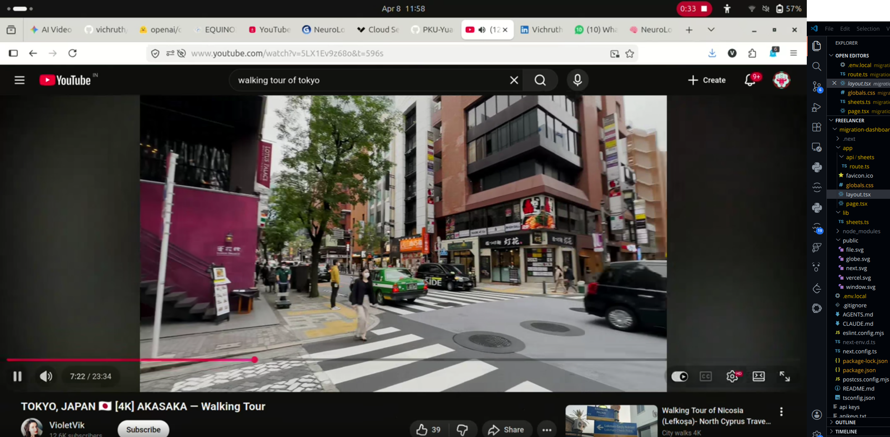
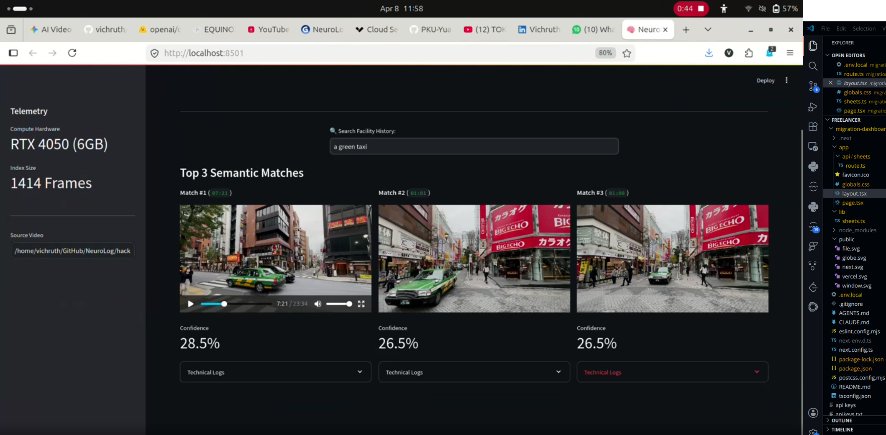
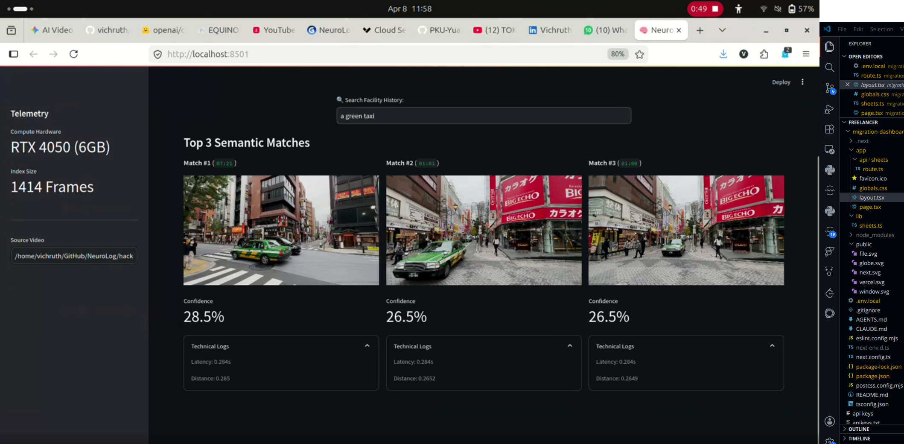

# NeuroLog — Edge-Native Semantic Video Search

[](https://opensource.org/licenses/MIT)
[](https://www.python.org/downloads/)
[](https://pytorch.org/)

**NeuroLog** is a fully offline, zero-shot multimodal video search engine that runs on consumer-grade edge hardware (a 6 GB-VRAM laptop GPU). It lets you search hours of raw video footage with natural-language queries — *"person wearing a black backpack,"* *"yellow taxi crossing the street"* — with no manual tagging, no labels, and no cloud API.
## Demo

NeuroLog searching ~24 minutes of street footage for the query *"a green taxi"* — fully offline on a 6 GB RTX 4050.
<table>
  <tr>
    <td><br><sub><b>1.</b> Source footage ingested</sub></td>
    <td><br><sub><b>2.</b> Query: "a green taxi"</sub></td>
    <td><br><sub><b>3.</b> Top-3 matches, ~0.284s</sub></td>
  </tr>
</table>

**Measured on an RTX 4050 (6 GB):** ~0.284 s query latency over a 1,414-frame index, fully offline, using FP16 inference.

---

## Why it exists

Traditional object detectors (e.g. YOLO) are limited to a fixed, closed vocabulary — they can only find what they were trained to label. NeuroLog instead uses **CLIP** embeddings with a vector index, enabling **open-vocabulary** retrieval: any concept you can describe in words can be searched, with zero task-specific training.

The design constraint that shaped every decision: it had to run **on-device, offline, within 6 GB of VRAM** — the kind of hardware available at the edge, where footage actually lives and where sending data to the cloud is often not an option.

---

## How it works

1. **Temporal ingestion.** OpenCV samples frames at a configurable rate (default 1 FPS).
2. **FP16 embedding.** Each frame is embedded with `openai/clip-vit-base-patch32`. The model and input tensors are cast to half precision (FP16) directly in PyTorch to fit the 6 GB budget, with negligible impact on retrieval quality.
3. **Normalized vector index.** The 512-dimensional embeddings are L2-normalized and stored locally in **FAISS** (`IndexFlatIP`). Because the vectors are normalized, inner-product search is mathematically equivalent to cosine similarity.
4. **Query UI.** A lightweight Streamlit dashboard embeds the text query into the same space and returns the top-K temporal matches with similarity scores and latency.

**Stack:** PyTorch · CLIP (ViT-B/32) · FAISS · OpenCV · Streamlit · NumPy

---

## Engineering challenges

The interesting part of this project was not the happy path — it was the optimization and the architectural decisions made under a hard hardware constraint.

### Fitting a Vision Transformer into 6 GB
Loading a standard ViT alongside OpenCV frame buffers and a UI repeatedly triggered out-of-memory crashes on the RTX 4050. I bypassed the high-level Hugging Face pipeline wrappers and worked directly with the raw PyTorch tensors, forcing the model and inputs into FP16. This brought the model's GPU memory use down to roughly 600 MB and made the full system (model + buffering + UI) run stably inside the 6 GB budget.

### Fine-grained recall vs. structural integrity — a measured trade-off
**Hypothesis:** small, distant objects (e.g. pedestrians in wide street views) were being washed out by the wide-angle background.

**Experiment:** I built a dual-embedding ingestion pipeline that embedded both the full 640×360 frame *and* a 50%-center-cropped tile (using the higher-resolution `patch16` model), roughly doubling index density.

**Result and decision:** fine-grained recall on small objects improved, but objects at the frame edges were truncated by the crop and their match confidence collapsed (~30% to <5%). Rather than keep a change that traded one failure mode for another, I rolled back to the stable full-frame `patch32` architecture and instead recovered fine-grained detail by upgrading the ingestion pipeline to handle higher-bitrate HD input — earning the recall back through cleaner pixel density rather than artificial cropping.

This is the part I'm most proud of: not the trick that worked, but the discipline to **measure, recognize a regression, and revert a clever idea** that wasn't a net win.

---

## Quick start

### Prerequisites
- Python 3.10+
- NVIDIA GPU with CUDA (developed/tested on an RTX 4050, 6 GB)

### Installation
```bash
git clone https://github.com/vichruth/NeuroLog.git
cd NeuroLog

python -m venv neurolog_env
source neurolog_env/bin/activate        # Windows: neurolog_env\Scripts\activate

pip install torch torchvision torchaudio --index-url https://download.pytorch.org/whl/cu118
pip install transformers opencv-python Pillow numpy faiss-cpu streamlit
```

### Run
```bash
# 1. Ingest a video and build the FAISS index
python ingest.py --video path/to/footage.mp4 --fps 1

# 2. Launch the search UI
streamlit run app.py
```
*(Adjust script names to match the repo.)*

---

## Results

| Metric | Value |
|---|---|
| Hardware | RTX 4050, 6 GB VRAM (consumer laptop GPU) |
| Index size | 1,414 frames |
| Query latency | ~0.284 s |
| Precision | FP16 (half) |
| Embedding model | CLIP ViT-B/32 (512-dim) |
| Connectivity | 100% offline — no cloud, no API |

---

## Roadmap
- Approximate-nearest-neighbour FAISS index (IVF/HNSW) to scale beyond linear search on large videos
- Temporal smoothing across adjacent frames to return clip segments rather than single frames
- Optional INT8 quantization for even lower-memory deployment

---

## Notes
Built as a solo project during a hackathon. Demo footage should be content you have the rights to use; the dataset is just ingested video frames — there is no training dataset, as retrieval is zero-shot.

## License
MIT
